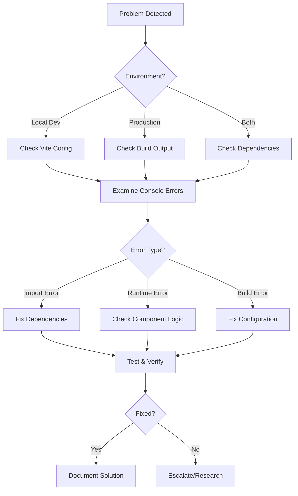

# 🚨 Complete React/Vite/Three.js Portfolio Troubleshooting Guide
*From Blank Pages to Production Success - A Student's Handbook*

---

## 📚 Table of Contents

1. [Introduction](#introduction)
2. [Common Symptoms & Quick Diagnosis](#symptoms)
3. [The Debugging Methodology](#methodology)
4. [Critical Error Categories](#error-categories)
5. [Step-by-Step Troubleshooting Process](#troubleshooting-process)
6. [Environment-Specific Issues](#environment-issues)
7. [Performance & Optimization Debugging](#performance-debugging)
8. [Deployment Issues](#deployment-issues)
9. [Preventive Measures](#preventive-measures)
10. [Advanced Debugging Techniques](#advanced-techniques)
11. [Recovery Strategies](#recovery-strategies)
12. [Tools & Resources](#tools-resources)

---

## 1. Introduction {#introduction}

### What This Guide Covers

This comprehensive guide addresses the most critical issues encountered when building modern React applications with:
- **Vite** (Build tool & dev server)
- **React 19** (UI framework)
- **Three.js/React Three Fiber** (3D graphics)
- **TypeScript** (Type safety)
- **Netlify** (Deployment platform)

### The Journey We'll Cover

Our debugging journey involved resolving:
- ✅ Blank/white pages in production
- ✅ Raw HTML display in development
- ✅ Missing dependencies and import errors
- ✅ Service worker conflicts
- ✅ Build configuration issues
- ✅ Performance optimization problems

### Prerequisites

Before starting, ensure you understand:
- Basic React concepts
- JavaScript ES6+ features
- Node.js & npm
- Git version control
- Browser developer tools

---

## 2. Common Symptoms & Quick Diagnosis {#symptoms}

### 🔍 Symptom Matrix

| Symptom | Local Dev | Production | Likely Cause |
|---------|-----------|------------|--------------|
| **Blank white page** | ❌ | ❌ | Critical JS error, missing dependencies |
| **Raw HTML display** | ❌ | ✅ Works | Vite config issue, base path problem |
| **3D scene not loading** | ⚠️ | ⚠️ | Three.js import issues, WebGL problems |
| **Build fails** | ❌ | ❌ | TypeScript errors, missing imports |
| **Fonts not loading** | ✅ Works | ❌ | CORS issues, font file paths |
| **Slow loading** | ⚠️ | ❌ | Bundle size, network issues |

### 🚨 Critical Red Flags

**Immediate Action Required:**
- Console errors mentioning missing modules
- TypeScript compilation failures
- Network 404 errors for critical assets
- Service worker registration failures

**Investigate Further:**
- Performance warnings in build output
- Large bundle sizes (>1MB for main chunks)
- High memory usage warnings
- MIME type mismatches

---

## 3. The Debugging Methodology {#methodology}

### 🎯 The ISOLATE Method

**I** - **Identify** the exact symptoms  
**S** - **Simplify** the problem (minimal reproduction)  
**O** - **Observe** error messages and logs  
**L** - **Locate** the root cause  
**A** - **Apply** targeted fixes  
**T** - **Test** thoroughly  
**E** - **Ensure** it doesn't regress  

### 🔧 Debugging Workflow



---

## 4. Critical Error Categories {#error-categories}

### 🚫 Category 1: Import & Dependency Errors

**Symptoms:**
```javascript
// Console errors like:
"Cannot resolve module './utils/icons'"
"Module not found: Can't resolve 'lucide-react'"
"TypeError: Cannot read properties of undefined"
```

**Common Causes:**
- Missing npm packages
- Incorrect import paths
- Empty or malformed files
- TypeScript configuration issues

**Investigation Steps:**
```bash
# Check if package exists
npm list lucide-react

# Verify file exists
ls -la src/utils/icons.ts

# Check import syntax
grep -r "from.*icons" src/
```

**Solutions:**
```bash
# Install missing packages
npm install lucide-react

# Fix import paths
# Wrong: import { Icon } from './utils/icons'
# Right: import { Icon } from 'lucide-react'

# Create missing files
touch src/utils/icons.ts
```

### 🌐 Category 2: Build Configuration Issues

**Symptoms:**
- Raw HTML in development but working in production
- Asset path 404 errors
- MIME type mismatches

**Common Causes:**
```typescript
// Problematic Vite config
export default defineConfig({
  base: './',  // ❌ Can cause dev server issues
  build: {
    outDir: 'build'  // ❌ Inconsistent with deploy config
  }
})
```

**Solutions:**
```typescript
// Fixed Vite config
export default defineConfig({
  base: '/',  // ✅ Consistent base path
  server: {
    host: true,
    port: 5173,
    strictPort: true  // ✅ Prevent port conflicts
  },
  build: {
    outDir: 'dist',  // ✅ Match deployment expectations
    sourcemap: true,
    chunkSizeWarningLimit: 1000
  }
})
```

### 🎨 Category 3: React Rendering Issues

**Symptoms:**
- Components not appearing
- Hooks errors
- State management problems

**Investigation Process:**
```tsx
// Create minimal test component
const TestComponent = () => {
  return <div>React is working!</div>
}

// Replace main App temporarily
import TestComponent from './TestComponent'
// ...
<TestComponent />
```

**Common Solutions:**
```tsx
// ❌ Common mistakes
const App = () => {
  const [state] = useState()  // Undefined initial state
  return <Component prop={undefined} />  // Undefined props
}

// ✅ Proper implementation
const App = () => {
  const [state] = useState(null)  // Defined initial state
  return state ? <Component prop={state} /> : <Loading />
}
```

### 🌍 Category 4: Three.js/WebGL Issues

**Symptoms:**
- Black screens where 3D should appear
- Performance warnings
- WebGL context errors

**Debugging Three.js:**
```tsx
// Add error boundaries around 3D components
const Scene3DWrapper = () => {
  return (
    <ErrorBoundary fallback={<div>3D Scene Failed</div>}>
      <Canvas>
        <Scene3D />
      </Canvas>
    </ErrorBoundary>
  )
}

// Check WebGL support
const checkWebGL = () => {
  const canvas = document.createElement('canvas')
  const gl = canvas.getContext('webgl') || canvas.getContext('experimental-webgl')
  return gl && gl instanceof WebGLRenderingContext
}
```

---

## 5. Step-by-Step Troubleshooting Process {#troubleshooting-process}

### 🔄 Phase 1: Initial Assessment

#### Step 1: Gather Information
```bash
# Check current state
git status
git log --oneline -10

# Check running processes
netstat -ano | findstr :5173  # Windows
lsof -i :5173  # Mac/Linux

# Check Node version
node --version
npm --version
```

#### Step 2: Identify Working Baseline
```bash
# Find last working commit
git log --oneline --grep="working\|fix\|stable"

# Check deployment history
# Visit Netlify dashboard > Deploys
# Note successful deployment commit hashes
```

#### Step 3: Reproduce Issue
```bash
# Clean environment
rm -rf node_modules
rm package-lock.json
npm install

# Try different commands
npm run dev      # Development
npm run build    # Production build
npm run preview  # Preview built version
```

### 🔧 Phase 2: Systematic Investigation

#### Step 4: Console Analysis
```javascript
// Open browser DevTools (F12)
// Check Console tab for errors
// Common error patterns:

// Import errors
"Cannot resolve module"
"Module not found"
"Unexpected token"

// Runtime errors
"Cannot read properties of undefined"
"TypeError: X is not a function"
"ReferenceError: X is not defined"

// Network errors
"Failed to fetch"
"404 Not Found"
"CORS error"
```

#### Step 5: Network Analysis
```javascript
// DevTools > Network tab
// Look for:
// - 404 errors (missing files)
// - CORS errors (cross-origin issues)
// - Large file sizes (performance impact)
// - Failed requests (network issues)

// Common problematic requests:
// - /src/main.tsx (404 = build issue)
// - /assets/*.js (404 = path issue)
// - /models/*.glb (404 = asset path issue)
```

#### Step 6: Build Analysis
```bash
# Analyze build output
npm run build

# Check for warnings:
# - Large chunk sizes
# - Circular dependencies
# - Missing dependencies
# - TypeScript errors

# Examine dist folder
ls -la dist/
ls -la dist/assets/
```

### 🎯 Phase 3: Targeted Resolution

#### Step 7: Fix Import Issues
```typescript
// Identify all import statements
grep -r "import.*from" src/

// Common fixes:
// ❌ import { Icon } from './utils/icons'
// ✅ import { Icon } from 'lucide-react'

// ❌ import Component from './Component'
// ✅ import Component from './Component.tsx'

// Check package.json for missing dependencies
cat package.json | grep -A 20 '"dependencies"'
```

#### Step 8: Fix Configuration Issues
```typescript
// vite.config.ts common fixes:
export default defineConfig({
  plugins: [react()],
  base: '/',  // Not './' for dev server
  server: {
    host: true,
    port: 5173,
    strictPort: true,
    cors: true
  },
  build: {
    outDir: 'dist',
    sourcemap: true,
    rollupOptions: {
      output: {
        manualChunks: {
          vendor: ['react', 'react-dom'],
          three: ['three', '@react-three/fiber', '@react-three/drei']
        }
      }
    }
  }
})
```

#### Step 9: Component-Level Fixes
```tsx
// Add error boundaries
class ErrorBoundary extends React.Component {
  constructor(props) {
    super(props)
    this.state = { hasError: false }
  }

  static getDerivedStateFromError(error) {
    return { hasError: true }
  }

  componentDidCatch(error, errorInfo) {
    console.error('Component error:', error, errorInfo)
  }

  render() {
    if (this.state.hasError) {
      return <h1>Something went wrong.</h1>
    }
    return this.props.children
  }
}

// Wrap problematic components
<ErrorBoundary>
  <Scene3D />
</ErrorBoundary>
```

---

## 6. Environment-Specific Issues {#environment-issues}

### 💻 Local Development Issues

#### Vite Dev Server Problems

**Issue:** Raw HTML display instead of React app
```bash
# Symptoms
curl http://localhost:5173
# Returns: <!DOCTYPE html><html>... (raw HTML)
# Expected: Rendered React application
```

**Root Causes:**
1. **Base path configuration**
2. **Port conflicts**
3. **Module resolution issues**
4. **CORS restrictions**

**Solutions:**
```typescript
// vite.config.ts
export default defineConfig({
  // ❌ Problematic
  base: './',

  // ✅ Fixed
  base: '/',
  server: {
    host: '0.0.0.0',  // Allow external access
    port: 5173,
    strictPort: true, // Fail if port unavailable
    open: true,       // Auto-open browser
    cors: true        // Enable CORS
  }
})
```

#### Node.js Version Issues
```bash
# Check compatibility
node --version  # Should be 16+ for Vite
npm --version   # Should be 7+

# Switch Node versions (if using nvm)
nvm use 18
nvm install 18.17.0
```

#### Cache Issues
```bash
# Clear all caches
rm -rf node_modules
rm package-lock.json
npm cache clean --force
npm install

# Clear Vite cache
rm -rf .vite
rm -rf dist
```

### 🌐 Production Deployment Issues

#### Netlify-Specific Problems

**Issue:** Blank page in production
```javascript
// Browser console shows:
"Failed to load resource: net::ERR_ABORTED 404"
"/assets/index-abc123.js net::ERR_ABORTED 404"
```

**Root Causes:**
1. **Incorrect build settings**
2. **Asset path mismatches**
3. **Missing files in build output**

**Solutions:**
```toml
# netlify.toml
[build]
  command = "npm run build"
  publish = "dist"  # Must match vite.config.ts outDir

[build.environment]
  NODE_VERSION = "18"

[[redirects]]
  from = "/*"
  to = "/index.html"
  status = 200
```

#### Asset Path Issues
```typescript
// vite.config.ts - Production asset paths
export default defineConfig({
  base: '/',  // Important for Netlify
  build: {
    outDir: 'dist',
    assetsDir: 'assets',
    rollupOptions: {
      output: {
        assetFileNames: 'assets/[name]-[hash][extname]',
        chunkFileNames: 'assets/[name]-[hash].js',
        entryFileNames: 'assets/[name]-[hash].js'
      }
    }
  }
})
```

---

## 7. Performance & Optimization Debugging {#performance-debugging}

### 📊 Bundle Analysis

#### Identifying Large Bundles
```bash
# Build with analysis
npm run build

# Look for warnings:
"(!) Some chunks are larger than 1000 kB after minification"
```

#### Bundle Composition Analysis
```javascript
// Install bundle analyzer
npm install --save-dev rollup-plugin-visualizer

// Add to vite.config.ts
import { visualizer } from 'rollup-plugin-visualizer'

export default defineConfig({
  plugins: [
    react(),
    visualizer({
      filename: 'dist/stats.html',
      open: true
    })
  ]
})
```

#### Code Splitting Solutions
```typescript
// Lazy load heavy components
const Scene3D = lazy(() => import('./components/3d/Scene3D'))
const Portfolio = lazy(() => import('./components/sections/Portfolio'))

// Component-level splitting
const App = () => {
  return (
    <Suspense fallback={<Loading />}>
      <Routes>
        <Route path="/" element={<Home />} />
        <Route path="/portfolio" element={<Portfolio />} />
      </Routes>
    </Suspense>
  )
}
```

### 🎮 Three.js Performance Issues

#### 3D Model Optimization
```javascript
// Check model file sizes
ls -lh public/models/*.glb

// Optimize models
// - Use Blender to reduce polygons
// - Compress textures
// - Remove unnecessary animations
// Target: <100KB per model
```

#### Conditional 3D Loading
```tsx
const Scene3D = () => {
  const [canRender3D, setCanRender3D] = useState(false)

  useEffect(() => {
    // Check device capabilities
    const isLowEnd = navigator.hardwareConcurrency < 4
    const isMobile = /Mobi|Android/i.test(navigator.userAgent)
    
    setCanRender3D(!isLowEnd && !isMobile)
  }, [])

  if (!canRender3D) {
    return <div className="fallback-content">3D not supported</div>
  }

  return (
    <Canvas>
      {/* 3D content */}
    </Canvas>
  )
}
```

---

## 8. Deployment Issues {#deployment-issues}

### 🚀 Git-Based Deployment

#### Commit Strategy for Debugging
```bash
# Save current work
git add .
git commit -m "WIP: Debugging deployment issues"

# Create feature branch
git checkout -b debug/deployment-fix

# After fix
git add .
git commit -m "Fix: Resolve blank page issue - updated base path"
git push origin debug/deployment-fix

# Merge back
git checkout main
git merge debug/deployment-fix
```

#### Finding Working Versions
```bash
# List recent commits with descriptions
git log --oneline --graph -10

# Find commits by date
git log --since="2 days ago" --oneline

# Find commits by author
git log --author="your-name" --oneline

# Check specific commit
git show 1db35b0  # Shows changes in that commit
```

### 🔄 Rollback Strategies

#### Safe Rollback Process
```bash
# Method 1: Reset to working commit
git reset --hard 1db35b0  # DESTRUCTIVE!

# Method 2: Create new commit reverting changes
git revert HEAD  # Safer approach

# Method 3: Checkout specific files
git checkout 1db35b0 -- src/main.tsx
git checkout 1db35b0 -- vite.config.ts
```

#### Branch-Based Recovery
```bash
# Create branch from working commit
git checkout -b working-version 1db35b0

# Apply optimizations gradually
git cherry-pick abc123  # Pick specific improvements
git cherry-pick def456  # Add model optimizations

# Test each change
npm run build
npm run preview
```

---

## 9. Preventive Measures {#preventive-measures}

### 🛡️ Development Best Practices

#### Error Boundaries Everywhere
```tsx
// Global error boundary
const GlobalErrorBoundary = ({ children }) => {
  return (
    <ErrorBoundary
      fallback={<ErrorFallback />}
      onError={(error, errorInfo) => {
        console.error('Global error:', error, errorInfo)
        // Send to error reporting service
      }}
    >
      {children}
    </ErrorBoundary>
  )
}

// Component-specific boundaries
const Scene3DWithBoundary = () => (
  <ErrorBoundary fallback={<div>3D Scene unavailable</div>}>
    <Scene3D />
  </ErrorBoundary>
)
```

#### TypeScript Strict Mode
```json
// tsconfig.json
{
  "compilerOptions": {
    "strict": true,
    "noUnusedLocals": true,
    "noUnusedParameters": true,
    "noImplicitReturns": true,
    "noFallthroughCasesInSwitch": true
  }
}
```

#### Pre-commit Hooks
```json
// package.json
{
  "husky": {
    "hooks": {
      "pre-commit": "npm run type-check && npm run lint",
      "pre-push": "npm run build"
    }
  }
}
```

### 📝 Testing Strategy

#### Component Testing
```tsx
// Basic component test
import { render, screen } from '@testing-library/react'
import App from './App'

test('renders without crashing', () => {
  render(<App />)
  expect(screen.getByText(/portfolio/i)).toBeInTheDocument()
})

// 3D component test
test('3D scene renders fallback on error', () => {
  const ThrowError = () => { throw new Error('Test error') }
  
  render(
    <ErrorBoundary fallback={<div>Fallback</div>}>
      <ThrowError />
    </ErrorBoundary>
  )
  
  expect(screen.getByText('Fallback')).toBeInTheDocument()
})
```

#### Build Testing
```bash
# Automated build testing
npm run build && npm run preview &
sleep 5
curl -f http://localhost:4173 || exit 1
```

---

## 10. Advanced Debugging Techniques {#advanced-techniques}

### 🔬 Source Map Analysis

#### Debugging Minified Code
```typescript
// vite.config.ts - Enable source maps
export default defineConfig({
  build: {
    sourcemap: true,  // Enables source map generation
    minify: 'terser',
    terserOptions: {
      compress: {
        drop_console: false  // Keep console.log for debugging
      }
    }
  }
})
```

#### Reading Production Errors
```javascript
// Production error format:
"TypeError: Cannot read properties of undefined (reading 'map')
  at index-abc123.js:1:2345"

// With source maps, becomes:
"TypeError: Cannot read properties of undefined (reading 'map')
  at Projects.tsx:45:12 (ProjectsList component)"
```

### 🕵️ Network-Level Debugging

#### Service Worker Debugging
```javascript
// Check service worker status
navigator.serviceWorker.getRegistrations().then(registrations => {
  console.log('SW registrations:', registrations)
})

// Clear service worker cache
caches.keys().then(names => {
  names.forEach(name => caches.delete(name))
})
```

#### Asset Loading Analysis
```javascript
// Monitor resource loading
const observer = new PerformanceObserver((list) => {
  list.getEntries().forEach((entry) => {
    if (entry.entryType === 'resource') {
      console.log(`${entry.name}: ${entry.loadEnd - entry.loadStart}ms`)
    }
  })
})
observer.observe({ entryTypes: ['resource'] })
```

### 🧪 A/B Testing Fixes

#### Feature Flags for Debugging
```tsx
const FeatureFlags = {
  ENABLE_3D: process.env.NODE_ENV === 'development' || 
             window.location.search.includes('enable3d=true'),
  ENABLE_PHYSICS: !window.location.search.includes('nophysics=true'),
  ENABLE_ANIMATIONS: !window.matchMedia('(prefers-reduced-motion)').matches
}

const App = () => {
  return (
    <div>
      {FeatureFlags.ENABLE_3D ? <Scene3D /> : <StaticBackground />}
      {FeatureFlags.ENABLE_PHYSICS ? <PhysicsWorld /> : null}
    </div>
  )
}
```

---

## 11. Recovery Strategies {#recovery-strategies}

### 🚑 Emergency Procedures

#### Quick Fixes for Production Down

**Step 1: Immediate Rollback**
```bash
# If you know the last working commit
git reset --hard 1db35b0
git push --force-with-lease origin main

# If you need to revert recent changes
git revert HEAD~3..HEAD  # Revert last 3 commits
git push origin main
```

**Step 2: Hot Fix Branch**
```bash
# Create emergency fix branch
git checkout -b hotfix/production-down

# Make minimal fix
# (e.g., comment out problematic component)

# Deploy immediately
git add .
git commit -m "Hotfix: Remove broken component temporarily"
git push origin hotfix/production-down

# Merge to main
git checkout main
git merge hotfix/production-down
git push origin main
```

**Step 3: Post-Incident Analysis**
```bash
# Document what went wrong
git log --oneline --since="1 day ago"
git diff HEAD~5..HEAD

# Create incident report
touch INCIDENT_REPORT_$(date +%Y%m%d).md
```

### 🔧 Systematic Recovery

#### The Bisect Method
```bash
# Find the exact commit that broke things
git bisect start
git bisect bad HEAD      # Current commit is bad
git bisect good 1db35b0  # This commit was good

# Git will checkout middle commit
# Test it: npm run build && npm run preview
# If broken: git bisect bad
# If working: git bisect good

# Continue until exact commit found
git bisect reset  # When done
```

#### Component-by-Component Recovery
```tsx
// Gradually re-enable components
const App = () => {
  const [enabledComponents, setEnabledComponents] = useState({
    hero: true,
    about: false,  // Start disabled
    portfolio: false,
    contact: false,
    scene3d: false
  })

  // Enable one at a time for testing
  useEffect(() => {
    const timer = setTimeout(() => {
      setEnabledComponents(prev => ({ ...prev, about: true }))
    }, 2000)
    return () => clearTimeout(timer)
  }, [])

  return (
    <div>
      {enabledComponents.hero && <Hero />}
      {enabledComponents.about && <About />}
      {enabledComponents.portfolio && <Portfolio />}
      {enabledComponents.contact && <Contact />}
      {enabledComponents.scene3d && <Scene3D />}
    </div>
  )
}
```

---

## 12. Tools & Resources {#tools-resources}

### 🛠️ Essential Debugging Tools

#### Browser Developer Tools
```javascript
// Console commands for debugging
console.table(performance.getEntriesByType('navigation'))
console.table(performance.getEntriesByType('resource'))

// Memory debugging
console.log('Memory:', performance.memory)

// Check for global leaks
Object.keys(window).filter(key => !window.hasOwnProperty.call(window.__proto__, key))
```

#### VS Code Extensions
- **Error Lens** - Inline error display
- **TypeScript Importer** - Auto-import suggestions
- **ES6 String HTML** - HTML in template literals
- **Auto Rename Tag** - Keep HTML tags in sync
- **GitLens** - Advanced Git integration

#### Command Line Tools
```bash
# Network analysis
curl -I https://yoursite.com  # Check headers
wget --spider -r https://yoursite.com  # Check all links

# Bundle analysis
npx webpack-bundle-analyzer dist/static/js/*.js

# Performance testing
lighthouse https://yoursite.com --output=html
npx @lhci/cli autorun  # Lighthouse CI
```

### 📊 Monitoring & Analytics

#### Performance Monitoring
```typescript
// Web Vitals monitoring
import { onCLS, onFCP, onLCP } from 'web-vitals'

const sendToAnalytics = (metric: any) => {
  console.log('Performance metric:', metric)
  // Send to your analytics service
}

onCLS(sendToAnalytics)
onFCP(sendToAnalytics)
onLCP(sendToAnalytics)
```

#### Error Tracking
```typescript
// Global error handler
window.addEventListener('error', (event) => {
  console.error('Global error:', {
    message: event.message,
    filename: event.filename,
    lineno: event.lineno,
    colno: event.colno,
    error: event.error
  })
})

// Promise rejection handler
window.addEventListener('unhandledrejection', (event) => {
  console.error('Unhandled promise rejection:', event.reason)
})
```

### 📚 Reference Documentation

#### Vite Configuration
- [Vite Config Reference](https://vitejs.dev/config/)
- [Vite Dev Server Options](https://vitejs.dev/config/server-options.html)
- [Vite Build Options](https://vitejs.dev/config/build-options.html)

#### React & Three.js
- [React 19 Migration Guide](https://react.dev/blog/2024/04/25/react-19)
- [React Three Fiber Documentation](https://docs.pmnd.rs/react-three-fiber)
- [Three.js Manual](https://threejs.org/manual/)

#### Deployment Platforms
- [Netlify Documentation](https://docs.netlify.com/)
- [Vercel Deployment Guide](https://vercel.com/docs)
- [GitHub Pages with Vite](https://vitejs.dev/guide/static-deploy.html#github-pages)

---

## 🎓 Summary & Final Tips

### Key Takeaways

1. **Systematic Approach**: Always follow the ISOLATE method
2. **Environment Differences**: Local vs Production issues have different root causes
3. **Version Control**: Git is your safety net - use it extensively
4. **Incremental Changes**: Make small changes and test frequently
5. **Documentation**: Keep detailed records of fixes for future reference

### Master Checklist

**Before Any Major Change:**
- [ ] Commit current working state
- [ ] Create feature branch
- [ ] Document expected behavior
- [ ] Plan rollback strategy

**When Issues Arise:**
- [ ] Identify exact symptoms
- [ ] Check browser console
- [ ] Test in different environments
- [ ] Create minimal reproduction
- [ ] Apply targeted fixes
- [ ] Test thoroughly

**After Resolution:**
- [ ] Document the solution
- [ ] Update preventive measures
- [ ] Share knowledge with team
- [ ] Monitor for regressions

### Remember

> "The best debugger is a methodical mind combined with good tools. Every bug is a learning opportunity, and every fix makes you a better developer."

---

*This guide is a living document. Update it as you encounter new issues and discover better solutions. Happy debugging! 🚀*
